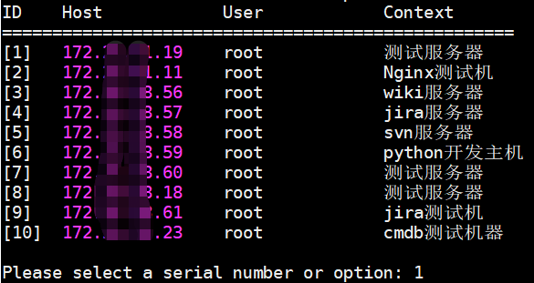

# gui-host-table
> 终端下主机列表脚本，可以实现ssh连接，依赖sshpass，用于解决常用主机登录问题

## 配置文件
配置文件支持密码与证书两种ssh连接方式，以英文":"分割的5部分组成    

格式如下：  
```
连接类型:主机地址:用户名:密码或证书路径:备注(不能用空格)

p:host:username:password:context
k:host:username:key-path:context
```
## 主要功能
```
s|S): 搜索(serach)    
r|R): 刷新(refresh)    
d|D): 下一页(next page)     
a|A): 上一页(previous page)     
exit): 退出    
```
按照主机ID编号，进行操作   
如图：

